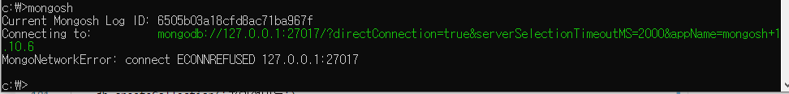
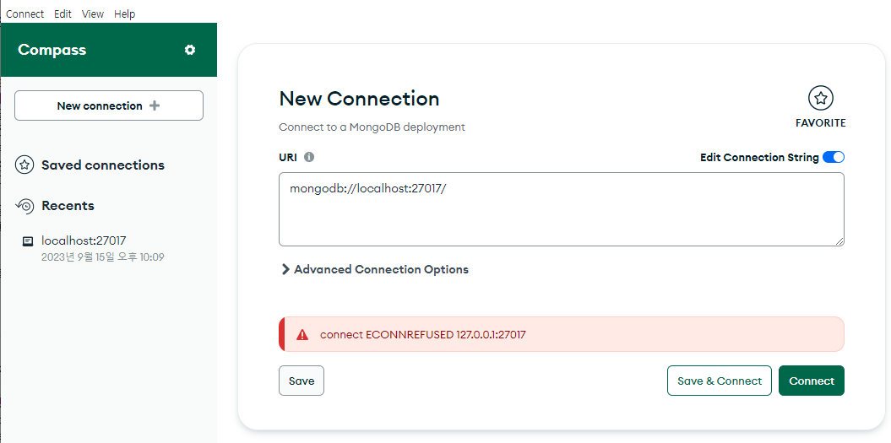
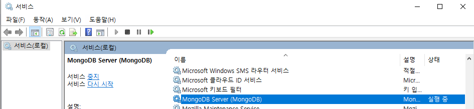
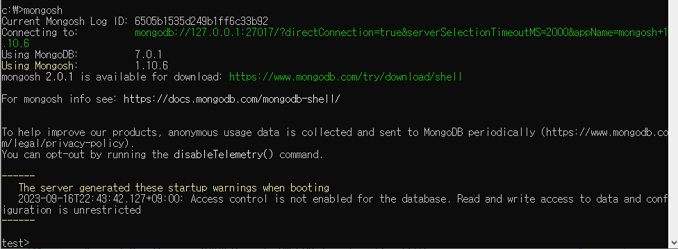
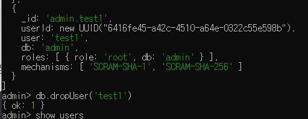
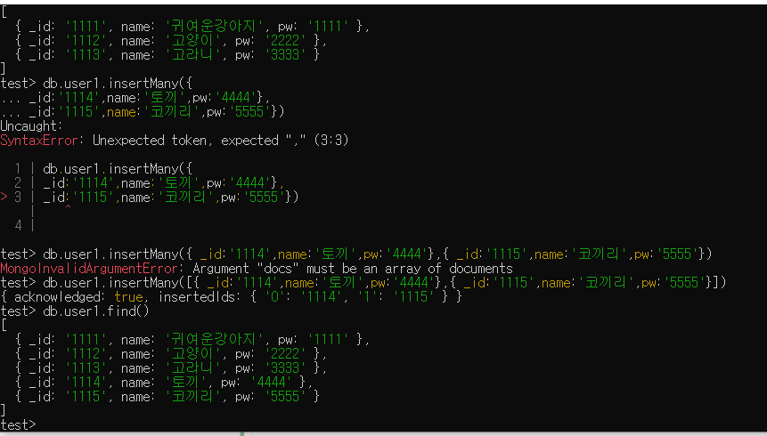

# NoSQL 배우기
    작성자 nxx5xxx
*  [MongoCompass - GUI 사용하기](#MongoCompass)
*  [MongoShell - CLI 사용하기](#MongoShell)
## 배우는 이유
    배워야 할 지식도 많지만
    관계형 데이터베이스는 Oracle SQL , MariaDB , MySQL , Postgres 정도를 배웠고
    NoSQL이랑 어떻게 다른지 어디에 쓰이면 더 적합할지 같은것이
    궁금하여 배우려고함
    궁극적으로는 어디에 취업할지 모르지만 모르는 지식을 하나라도 더 보완하고싶은 욕구

## NoSQL의 장점
    데이터 베이스의 변형이 쉽다
    쿼리가 빠르다
    개발친화적이다
## NoSQL의 단점
    ACID 트랜잭션을 지원하지 않는다

### 학습하면서 추후 더 기재할것
---
## MongoDB를 사용하여 배우기
    백앤드 로드맵과 순위를 보니 MongoDB가 제일 많이 사용하는듯 하여 
    MongoDB를 사용하여 배우도록 하겠다
## 다운로드
    https://www.mongodb.com/try/download/community

    자신의 컴퓨터 사양에 맞는것으로
    누군가 내 글을 볼지는 모르겠으나
    혹여나 이 글을 읽고 내 컴퓨터가 몇 비트인지 모르는사람은
    윈도우키+R을 눌러 dxdiag 를 친 후
    시스템 탭에서 하단에 시스템 정보란에 운영체제 를 보면 몇비트인지 쓰여있다
    x86 - 32비트 /// x64 - 64비트
    여기서 비트는 cpu의 비트라고 할 수 있는데
    32비트는 2의 32승 즉,
    4,294,967,296 바이트의 메모리밖에 사용할수 없다 (즉 4기가)
    대충 램 4기가 이상 인식 못하니까 요즘컴퓨터에선 거의 64비트를 쓰긴한다
    이 얘기가 왜 나왔지

    아무튼 몽고DB아틀라스처럼 로컬서버를 사용하지않고 하는법 도 있지만
    여러가지 알라고하면 힘드니까 로컬방식부터 배워보겠다

## 설치법
    다운받은 몽고DB 설치파일(윈도우 기준 msi)
    실행 후
    Next > I accept~~~ 체크 Next > 상단Complete 누르기 
    두개 옵션이 뜨는데 위에는 윈도우즈 사용자계정으로 실행하는 설정
    아래는 도메인사용자로 하는설정
    우리는 위에것으로 할것이다
    MongoCompass라는것을 설치할거면 체크하라고 써있는데
    Gui기반으로 가능하게 해주는것같다 (맞을거임)
    원한다면 체크하고 넥스트 설치

    다 설치가 완료되었다면 cmd창에 들어가
    mongod --version 를 입력해본다

    db version v7.0.1
    Build Info: {
        "version": "7.0.1",
        "gitVersion": "425a0454d12f2664f9e31002bbe4a386a25345b5",
        "modules": [],
        "allocator": "tcmalloc",
        "environment": {
            "distmod": "windows",
            "distarch": "x86_64",
            "target_arch": "x86_64"
        }
    }

    이런식으로 뜨는것을 확인할 수 있다

### 만일 mongod --version 이 안될경우
    시스템속성에 들어가 (좌측하단 찾기창에 변수 를 쳐서 검색해도 된다)
    고급>환경변수 > 사용자변수와 아래쪽 시스템변수 중 아래쪽 시스템변수 Path에 편집을 눌러
    몽고db설치경로(바꾸지 않았다면 C:\Program Files\MongoDB\Server\7.0\bin 이것이 기본값)
    을 추가해준후 확인을 눌러 변수와 시스템속성을 빠져나온 후 다시 mongod --version을 쳐본다

## MongoDB Compass 사용하기

    Shell을쓴 cli기반이 아닌 compass를쓴 gui기반으로 공부하려한다

    처음 화면을 키면 다음과 같은 화면이 나온다
    여기서 바로 Connect를 눌러도 되지만 외부와 연결하려 할 경우
    Advanced Connection Options를 눌러 추가 설정을 할 수 있는데
    이것은 나중에 기회가되면 기술하도록 한다

    왼쪽에 + 를 누르면 데이터 베이스를 만들 수 있다
    여기서 DBName을 써준 후
    Collection Name을 써주면되는데 
    Collection은 RDBMS의 테이블이라 생각하면 된다

    DatabaseName을 test로하고
    Collection Name을 user1로해서 만든것
    생설할때 Addtional preferences를 누르면
    Capped Collection 외에도 두개가 더있는데
    내가 알게된건 Capped 기능하나뿐..
    최대 사이즈를 정해 그 사이즈가 넘어가게 되는경우
    기존 사용하고 있는 공간을 재사용 하게되는것
    로그 등 에 적합하다고 한다
    암튼 로그 할것 아니니 체크안하고 만들었다

### document Crud
    도큐먼트 에대해 찾아보다가 너무 잘정리되어있는 블로그를 발견해서 퍼왔다
    출처 : https://javacpro.tistory.com/66

    
    즉, document는 RDB에서 각 행(세로줄) 이라고 보면 될거같다
### document insert
    

    아까 창을 다시 보면 test.user1 이라고 써있는것을 볼 수 있는데
    test라는 database의 user1이라는 collection에 들어가 있는 상태인것이다
    여기서 Add Data를 눌러 Insert Document를 클릭한다
      

    이런창이 뜰텐데 여기서 _id는 고유키 같은거로 생각할 수 있다
    _id를 직접 입력하지 않으면 키가 자동으로 추가된다
    _id는 기본적으로 ObjectId이며 데이터형으로도 쓸 수 있다
    위 사진은 오브젝트

      

    이런식으로도 입력 할 수 있고 (여기서는 _id를 데이터로)
    _id를 입력하지 않으면 자동으로 추가되니 입력하지않고 해보겠다

 

    안된다 뭐가문제일까
    다시_id 를 넣고 해봤지만 안된다 뭘까

 

    중괄호에 중괄호를 넣는게 아닌
    대괄호에 중괄호를 넣었어야했다

 

    insert를 누르면 데이터가 들어간것을 확인 할 수 있다

 

    update는 수정하고싶은 데이터를 더블클릭 후 수정한 다음
    update를 누르면 수정이된다

 

    삭제는 해당 도큐먼트 우측 상단에 있는 쓰레기통을 클릭하면
    삭제할 수 있다

    https://www.mongodb.com/docs/compass/master/

---

## MongoDB shell 사용하기 
### 사용하기에 앞서
    다른 글 들을 보니 cmd창에서 mongo만 치면 접속이 되지만
    몇 버전부터인지는 모르겠으나 내가쓰는 버전에는 mongo.exe파일이 안들어있다
    mongosh를 설치해야하는데 설치하는 주소는
    https://www.mongodb.com/try/download/shell
    이 되겠다

    zip파일과 msi로 받을 수 있는데 msi로 설치하겠다
    해당 파일을 받은 후
    Next> 이 계정에만 설치할게 아니라면 Install Just for you의 체크를 해제>next>install

    설치 후 cmd에 mongosh를 친다

    근데?

    아 뭐지....

    
    몽고컴파스도 안된다
    어제와 오늘 내 컴퓨터의 달라진점은 껏다 킨 후 몽고쉘을 설치한것 뿐인데
    왜 안될까 하고 생각해봤다

    정답은 이것
    점유율을 조금이라도 낮추기위해 db를 안쓸때는 서비스를 꺼두는데
    (수동으로 해놓고 다시시작한다 보통)
    이것때문이었다

    다시 하니까 잘된다
    근데 방금 다운받았는데 2.0.1을 사용할수 있다네..?
    그냥해야지

### MongoShell 사용하기

    먼저 use admin으로 접속하여 관리자 계정으로 들어가
    유저를 만들어준다
    명령어는 db.createUser({user:'유저네임',pwd:'비밀번호',roles:['root']})
    여기서 root는 최상위 권한으로 알고있다
    아 git으로 혼자 공부하면 안좋은점을 알았다
    누군가 보고 피드백을 줄 수 없다 >> 내 지식이 정확하게 쌓여가는지 알 수 없음
    물어볼곳이 없다 >> 쉬운문제도 시간을 많이 소모하게됨
    큰일났다

### 생성한 유저 확인하기
    

    show users 명령어로 확인할 수 있다
    해당 유저를 지우는 명령어는 db.dropUser('유저명')

### 명령어들
#### 데이터베이스 관련
*   use 데이터베이스 명

    해당 데이터 베이스를 사용한다
*   show dbs

       현재 생성되어있는 데이터 베이스 목록조회
* db

    현재 실행중인 데이터 베이스를 출력
* db. ~~ 현재 db에 대한 ~~ 명령어를 실행
#### 컬렉션 관련
*   show collections : 현재 접속중인 db 컬렉션 목록 조회
*   db.createCollection('컬렉션명') : 컬렉션 생성
*   db.컬렉션명.insertOne({_id:"고유키값" , 컬럼1 , 컬럼2 ....})

        단일 레코드 삽입 ( 레코드 또는 튜플이라고 생각하면 된다 )
*   db.컬렉션명.insertMany([{_id:'고유키값' , 컬럼1 , 컬럼2 .... } , {_id : '고유키값2' , 컬럼1 ....}])

        다중 도큐먼트 삽입 ( 레코드 또는 튜플이라고 생각하면 된다 )

  열심히 틀려가며 하나씩 해보는 내모습 언젠가 보면 웃기겠지

*   db.컬렉션명.find() : 해당 컬렉션 조회 (테이블조회 처럼 생각하면 된다)

        db.컬렉션명.find({"키" : "값"})
        같은 키를 넣고 조회하면 마지막에 들어간 값 중심으로 조회가 된다

*   db.컬렉션명.remove({"키":"값"})

        해당 키와 값이 있는 도큐먼트를 삭제한다

*   db.컬렉션명.drop() : 해당 컬렉션 삭제

## 쉘 명령어 정리
    use admin
    db.createUser({ user: '아이디', pwd: '패스워드', roles: ['root']})
    DB 생성 > use DB이름 (이용가능한 데이터베이스가 존재하지않을경우 새로 생성함)
    db목록 보기 show dbs
    collection생성하기
    db.createCollection('콜렉션이름')
    콜렉션목록 show collections
    .find( { “likes”: { $lte: 30 } } ) : lte는 less than 30이하 의 뜻

*    find 명령문에 대해 참고하면 좋을 블로그
    https://velopert.com/479

### 정리하며 드는생각
    1. 스프링 할때 썻던 jpaRepository 에서 제공하는 쿼리메소드와 비슷하단 느낌이 들었다.
    2. 자바스크립트와 비슷하다 - 느낌이..? 뭐라해야하지 암튼 뭔가 비슷한 느낌을 받았다
    3. 없는 도큐먼트컬럼 , 데이터베이스 등을 사용하기만 해도 알아서 생성해주니 편리한것 같았다
    4. inner join은 불가하고 outer조인만 가능하다는데 $lookup이란걸 사용해야하고 그마저도 자주 사용해서는 안된다고 한다
    5. 정말 많은양의 데이터를 관리하기엔 편할거같다
    6. noSql을 사용해서 프로젝트 하나 만들어보면 좀더 생각이 정리되지 않을까 싶으니까 이력서도 내며 프로젝트 하나 더 만들어 봐야겠다