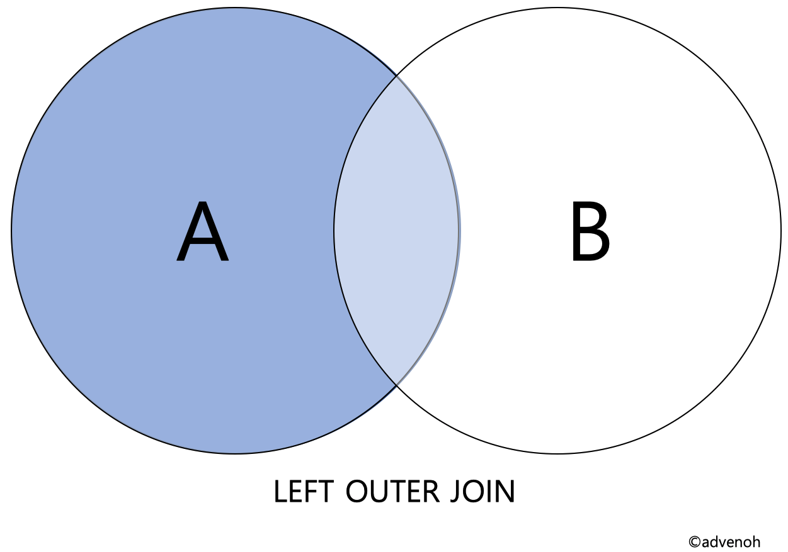
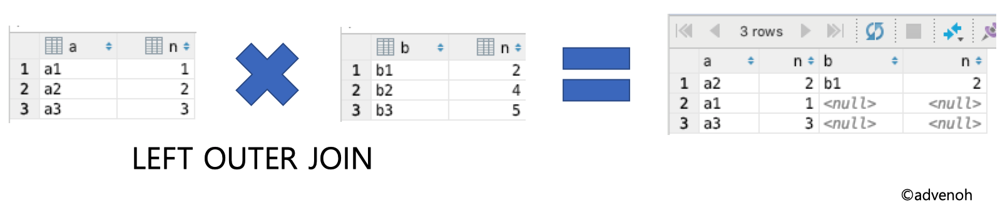
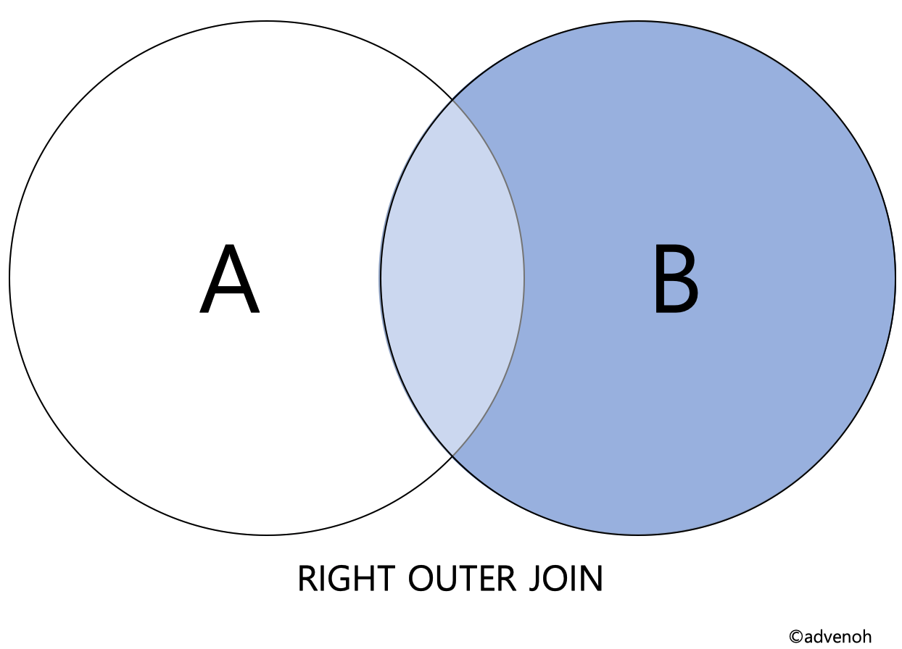
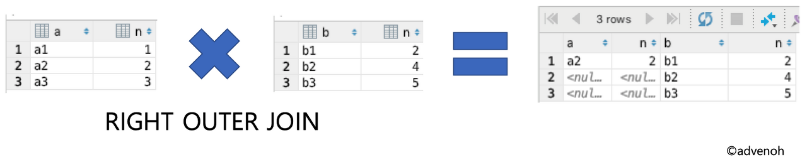
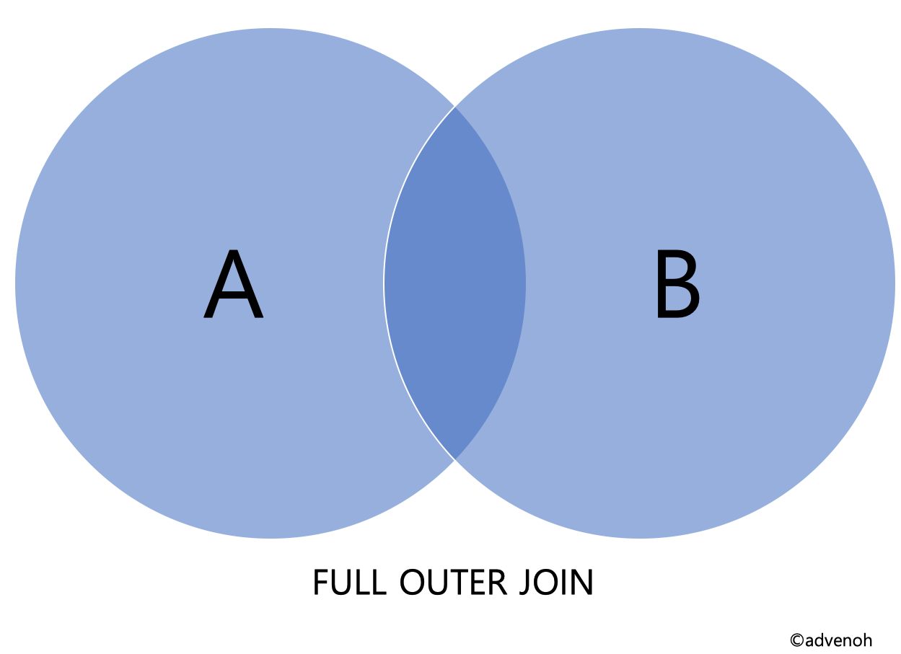
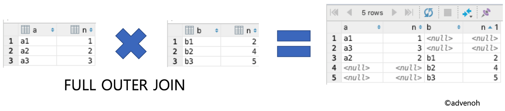
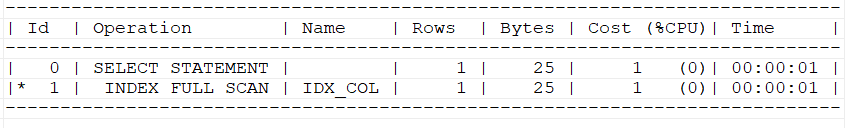
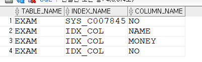

[목록으로](https://github.com/nxx5xxx/study/blob/master/readme.md)
<a href="#abt" style="font-size: 24px;">맨 아래로</a>

# 산업기사 필기정리2
# SQL활용

- 데이터 사전개념   
    1. DB의 데이터(사용자 데이터) 를 제외한 모든정보가 있다.
    2. 내용 변경하는 권한은 시스템사용자(DBA)가 가진다 - 
        일반 사용자는 단순 조회만 가능
    3. 데이터 사전은 메타 데이터로 구성되어 있다.

- 데이터 사전내용
    1. 사용자 정보(ID,PW 및 권한)
    2. 데이터베이스 객체(테이블, 인덱스, 뷰)
    3. 무결성 제약 상태
    4. 함수, 프로시저 및 트리거 정보

## DDL (Data Definition Language) 데이터 정의어 - Object
- 스키마
    1. DBMS의 특징과 구축환경에 기반한 데이터 구조
    2. 하나의 데이터 베이스 (DBMS마다 다르다)

- 도메인
    1. 속성의 데이터 타입과 제약조건들을 설정한 정보
    2. 속성이 가지는 값의 범위로 이해할 수 있다

    ex) 주소를 VARCHAR2(12)으로 정의
- 테이블
    * 데이터 저장공간
- 뷰
    * 1개 이상의 물리테이블을 통해 만드는 가상의 논리 테이블
- 인덱스
    * 빠른 검색을 위한 대이터 구조
### DDL 명령어
    CREATE      오브젝트 생성
    ALTER       오브젝트 변경
    DROP        오브젝트 삭제
    TRUNCATE    오브젝트 내용 삭제 (DB내 로깅작업 건너 뜀)
### DDL 테이블 생성
    CREATE TABLE 테이블명( 
        컬럼명 타입 [DEFAULT 값] [NOT NULL] [PRIMARY KEY],~~
        ,FOREIGN KEY(참조받을 컬럼) REFERENCES 테이블명(참조할 컬럼)
        [ON DELETE 옵션] [ON UPDATE 옵션]
        [CHECK (조건식) | UNIQUE (컬럼명)]
    );
### 다른 테이블 정보로 활용한 생성
    CREATE TABLE 테이블명 AS SELECT~~ (뷰도 이와동일)

### 테이블 변경
* 컬럼(열) 추가

     ALTER TABLE TABLE명 ADD 컬럼명 TYPE;
* 컬럼타입변경

     ALTER TABLE TABLE명 MODIFY 컬럼명 TYPE;
* 컬럼삭제

     ALTER TABLE 테이블명 DROP 컬럼명;
    
* 테이블 삭제

    DROP TABLE TB명;

* 테이블 내용 삭제

    TRUNCATE TABLE TB명;

* 테이블명 변경

    RENAME TABLE 원본테이블 TO 바꾼후테이블명;

    ALTER TABLE 원본명 RENAME 바꾼후테이블명;

## DML (DATA MANIPULATION LANGUAGE) - 데이터 조작어
    DML (DATA MANIPULATION LANGUAGE)
    SELECT INSERT UPDATE DELETE 

## DCL (DATA CONTROL LANGUAGE) - 데이터 제어어
    트랜잭션의 처리인 TCL 또한 DCL에 속한다
    GRANT REVOKE
    COMMIT ROLLBACK CHECKPOINT

## ROLL 객체
1. CONNECT :        DB 접속권한
2. RESOURCE :       TB또는 INDEX생성권한
3. CREATE VIEW :    VIEW 생성권한
4. DBA :    모든권한

## 다중테이블조회 (DML)
    조인 : 두개의 테이블을 결합해 조회
    서브쿼리 : SQL문 안에 포함된 SQL문 사용기법
    집합연산자 : 테이블 집합 개념으로 조작하는 기법

### 조인
- 물리적 조인
        
    DBMS 옵티마이저 엔진에 의해 발생하는 테이블 결합방식

    Nested loop join(중첩 루프 조인), Merge Join(병합조인) , Hash Join

- 논리적 조인

    SQL 문에 의해 표현 , 내부 외부로 나뉜다

### 논리적 조인
#### 내부조인
-   두 테이블에 공통으로 있는 컬럼을 활용해 조회
1. 동등조인(EQUI JOIN) : 동일한 컬럼명 기준으로 같은값을 조회한다

        명시적 ) : select * from tb1 inner join tb2 on tb1.no = tb2.no;
        묵시적 ) : select * from tb1 , tb2 where tb1.no = tb2.no;

2. 자연조인(NATURAL JOIN) : 모든 컬럼값이 같은경우 추출

        ex ) : select * from tb1 natural join tb2;
자연조인과 동등 조인의 차이는 동등 조인은 tb1.no , tb2.no 를 둘다 출력 하지만
자연조인은 컬럼명과 값이 같은 행은 하나씩만 출력한다

3. 교차조인(CROSS JOIN) : 조인 조건이 없는 모든 데이터 추출

        명시적) : select * from tb1 coress join tb2;
        묵시적) : select * from tb1, tb2;

4. 셀프조인(SELF JOIN) : 같은 테이블 내에서 활용

        ex ) : select a.no,a.name ,b.ename, b.no from tb1 a INNER JOIN tb1 b ON a.name=b.ename;

#### 외부조인
- 왼쪽외부조인(LEFT OUTER JOIN)

    왼쪽 외부 조인은 테이블1의 모든데이터와 테이블2가 매칭이 되는 레코드를 포함하는 조인
    

    ex) SELECT * FROM tb1 LEFT OUTER JOIN tb2 ON tb1.n = tb2.n
    
    

- 우측외부조인(RIGHT OUTER JOIN)
    
    왼쪽 외부 조인은 테이블2의 모든 데이터와 테이블1과 매칭이 되는 레코드를 포함하는 조인
    (왼쪽외부조인의 반대)
    

    ex) SELECT * FROM tb1 RIGHT OUTER JOIN tb2 ON tb1.n=tb2.n
    

- 완전외부조인(FULL OUTER JOIN)

    INNER , LEFT OUTER , RIGHT OUTER 조인 집합을 모두 출력하는 조인

    참조 테이블에 반드시 값이 존재한다는 보장이 없을경우 사용된다

    

    ex) SELECT * FROM tb1 FULL OUTER JOIN tb2 ON tb1.n = tb2.n;
    

- 완전외부 조인을 이용한 ONLY OUTER JOI
    
    FULL OUTER JOIN 한 데이터 중 둘다 모두 있는 데이터를 제외한 각각에만 존재하는 데이터를 추출한것

    ex ) : select * from tb1 FULL OUTER JOIN tb2 ON tb1.n = tb2.n where tb1.a is null or tb2.b is null;

### 서브쿼리
1. SQL문 안에 또 다른 SQL

    ex) : select * from .... where .... (select ....)
    여기서 뒤에오는 select문이 서브쿼리다

2. 주종관계라 서브쿼리에 작성된 컬럼명은 메인컬럼에서 갖고올 수 있으나 반대의 경우는 불가능 하다

* 유형1
    * 비연관(UN-CORRECLATE) 서브쿼리

        서브쿼리안에 메인쿼리의 컬럼 정보를 갖고있지 않은 상태 

        (서브쿼리는 메인쿼리 없이 독자적으로 실행)

    * 연관(Correlated) 서브쿼리

        서브쿼리 안에 메인쿼리의 칼럼정보를 가지고 있는 형태

        (메인쿼리의 실행된 결과를 통해 서브쿼리의 조건이 맞는지 확인)

* 유형2
    * Single Row 단일행
        1. 서브쿼리의 결과가 항상 1건 이하인 서브쿼리
        2. 단일행의 비교연산자에는 =,<,<=,>,>=,<> 등이 사용된다

    * Multiple Row 다중행
        1. 서브쿼리의 결과가 여러건인 서브쿼리
        2. 다중행의 비교 연산자에는 IN , EXISTS, ALL , ANY 등이 사용된다

    * Multiple Column (다중컬럼)
        1. 서브쿼리의 실행결과가 2개 이상 컬럼으로 반환되는 쿼리
        2. 메인쿼리 조건절에 다수컬럼을 비교할 때 , 서브쿼리와 메인쿼리에서 비교하는 
        컬럼 개수, 위치가 동일해야 한다.

### 집합연산자
UNION
* 2개 이상의 SQL문 중복을 제거한 합집합
* ex ) : select - from - where - UNION ALL select - from - where -

UNION ALL
* 2개 이상의 SQL문 중복을 제거하지 않은 합집합

INTERSECTION - 오라클의경우 intersect
* 2개 이상의 SQL문 중복을 제거한 교집합

EXCEPT(MINUS) - 오라클의경우 minus
* 선행 SQL문 실행결과와 후행 SQL문 실행결과의 교집합을 제거한것 - 차집합

#### 2개 이상이라고 써있는것은
SELECT * FROM (SELECT ~ WHERE ~ UNION ALL SELECT ~ WHERE ~ UNION ALL SELECT ~ WHERE ~) WHERE    ROWNUM<4
이런식 으로 다중 집합연산이 가능하다

## DB테이블 외 데이터 사전조회
    오라클은 뷰로 데이터 사전에 접근할 수 있다 .
    3가지 영역으로 구분된다

* DBA_ : 데이터 베이스의 모든 객체 조회가능 (DBA_ 는 시스템 접근권한을 의미한다)
1. DBA_TABLES : 모든 테이블 목록 확인
2. DBA_INDEXES : 모든 인덱스 목록 확인
3. DBA_IND_COLUMNS : 모든 인덱스의 구상컬럼 확인
4. DBA_VIEWS : 모든 뷰 목록 확인

* ALL_ : 자신의 계정으로 접근가능한 객체와 타계정의 접근권한을 가진 모든객체 조회 가능
1. ALL_TABLES : 권한있는 테이블 목록 확인
2. ALL_INDEXES : 권한있는 인덱스 목록 확인
3. ALL_IND_COLUMNS : 권한있는 인덱스의 구성컬럼 확인
4. ALL_VIEWS : 권한있는 뷰 목록 확인

* USER_ : 현재 자신의 계정이 소유한 객체 조회 가능
1. USER_TABLES : 자기계정의 테이블 목록확인
2. USER_INDEXES : 자기 계정의 인덱스 목록 확인
3. USER_IND_COLUMNS : 자기 계정의 인덱스 구성컬럼 확인
4. USER_VIEWS : 자기계정 뷰 목록 확인

## 인덱스
    저장된 데이터를 빠르게 검색할 수 있는 수단. 즉 테이블에 대한 조회속도를 높여주는 자료구조
    이는 테이블에 있는 특정 레코드 위치를 알려주는 수단으로 사용된다
    
### 사용예시
* 인덱스 생성 : create index idx_col on exam(no,name,money);
* 인덱스 확인 : 

    explain plan for select no,name,money from exam where 1=1 and no = 10001;

    SELECT * FROM TABLE(DBMS_XPLAN.DISPLAY);

    

* 인덱스 조회 :

    SELECT TABLE_NAME, INDEX_NAME, COLUMN_NAME
    FROM ALL_IND_COLUMNS
    WHERE TABLE_NAME = 'EXAM';

    

    [목록으로](https://github.com/nxx5xxx/study/blob/master/readme.md)
<a href="#" style="font-size: 24px;" id="abt"> 상단으로 </a>