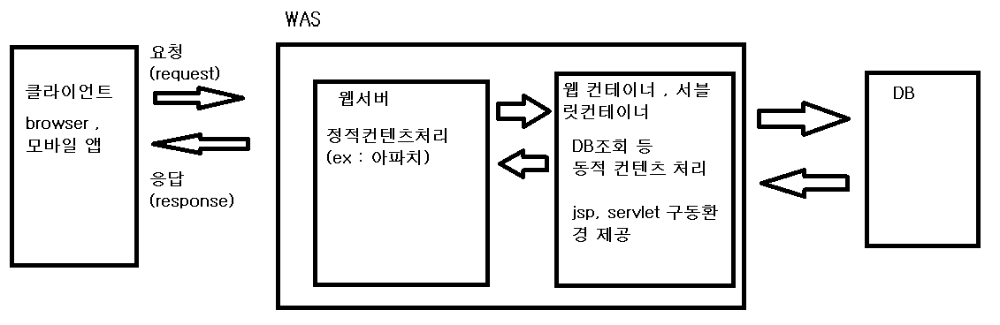

[목록으로](https://github.com/nxx5xxx/study/blob/master/readme.md)
<a href="#abt" style="font-size: 24px;">맨 아래로</a>

# 산업기사 필기 정리 1
## 애플리케이션 배포

### 소스코드 빌드과정
- 컴파일언어 (c , c++)
    
    1. 기계어로 컴파일 후 실행되기 때문에 속도가 빠르다
    2. 컴파일 과정이 있기 때문에 빌드속도가 느리다
    3. 소스코드 변경시 마다 컴파일을 해줘야 한다

    빌드과정

        소스코드->[전처리기(preprocessor)]->[파싱parser]-parse free->
        [번역(translation)]-assembly->[어셈블러(Assembler)]-object file->[링커(Linker)]
        -exe file->[Loader]->메모리Image

- 바이트언어 (java , c#)

    1. 컴파일 결과물이 실행파일이 아닌 class 파일로 생성된다
    2. 가상실행환경인 JRE , CLI 에서 한줄씩 실행하는 방식으로 빌드된다
    3. 실행될 때 기계어로 변환되며 컴파일 언어에 비해 빌드과정이 빠르다

    빌드과정

        소스코드->[컴파일러]-Byte code->{JRE[Byte Code Verifier] [class Loader] [Just in Time Complier]} -Native Code-> [OS]

- 인터프리터 언어 (Python , Ruby , JavaScript)

    1. 한줄씩 번역되어 실행된다
    2. 한줄씩 번역하여 실행하므로 실행속도가 느리다
    3. 별도의 컴파일 과정없이 바로실행된다 -> 메모리가 훨씬 적게 소모된다

    빌드과정

        소스코드->[인터프리터]->실행결과
                    ↗
                데이터
---
### 애플리케이션 배포환경
    ㄴ> 개발자, 사용자가 애플리 케이션을 실행 테스트 할 수 있도록 컴파일 된
    프로그램, 실행에 필요한 리소스(이미지,환경설정 파일 등) 을 서버상의 적합한 윌치로 이동하는 작업
    
    Application 배포는 해당 어플리케이션 동작환경의 영향을 받는데
    웹 애플리케이션의 경우 웹서버 , WAS 를 동작환경으로 사용한다

-    WAS 구성

        

- Web Server (아파치)

    사용자의 Http 요청을 받아 웹컨테이너에 요청(request)을 전달하고
    응답(response)를 받아와 사용자에게 전송하는 역할을 수행한다
    애플리케이션 배포시 정적인 리소스를 배포(img,css,html)

    하드웨어 : Web Server가 설치되어있는 컴퓨터
    소프트웨어 : 클라이언트(브라우저,앱) 로 부터 http 요청을 받아 정적콘텐츠를 뿌려준다
- WAS (Web Application Server)
    Web Server + Web Container

    1. DB조회등 다양한 로직 처리를 요구하는 동적인 컨텐츠를 제공하기 위해 만들어진 application server
    2. 웹컨테이너 , 서블릿 컨테이너 라고 불린다

        여기서 컨테이너란 Jsp,Servlet을 실행시킬수 있는 SW . 즉, WAS는 jsp , servlet 구동환경을 제공한다

    3. 프로그램 실행환경과 DB접속 기능 제공
    4. 여러개의 트랜잭션 (논리적 작업단위) 관리기능
    5. 업무를 처리하는 비즈니스 로직 수행
---
### 애플리케이션 배포단위

- JAVA의 경우
    
    - jar (Java Archive)
        
        자바 라이버르러, 리소스 , 프로퍼티 파일들을 포함한다.

        라이브러리, 구현된 비즈니스 서비스를 배포할 때 jar단위로 패키징 한다.

    - war (Web Archive)

        웹컨테이너에 배포되는 배포형식으로 Servlet , jar , web-inf 내의 web.xml 등 
        독립적인 UI 단 웹 애플리케이션 서비스를 제공한다

    - ear (Enterprise Archive)

        jar와 war를 묶어서 하나의 완성된 웹 어플리케이션 서비스를 제공한다.
---
### 형상관리
    계획부터 개발 , 운영 , 유지보수 , 폐기 까지 발생하는 모든 활동을 지속적으로 관리하는것
    이를 위해 형상 항목들에 대해 식별관리 표시를 붙여 추적이 가능하게 만들어야 한다.

- 형상항목
    
    형상관리 대상이 되는 항목을 의미하며, 유일한 식별자가 부여되어 개별적으로 관리되는 소스파일, 문서, 기타파일 등

- 기준선(base line)

    공식적으로 검토되고 협의되어 향후 기준이 되는 형상항목의 집합체

- 마이그레이션

    개발완료된 시스템이 운영단계로 전환될 때 관련 소스파일을 저장공간(레포지토리) 으로 이관시키는 작업

- 레포지토리

    관리대상을 형상관리 시스템으로 일단 전송하여 압축, 암호화 후에 저장, 관리하는 저장공간을 의미
    일반적으로 업무 또는 디렉토리 단위로 ㄷ구성된다.

- 워크플로

    형상관리 활동을 수행하기 위해 미리 정해진 절차가 형상관리 시스템 안에 구현되어 있는것을 의미한다
---
### 애플리케이션 개발 기간중 사용한 배포유형 및 기준

- 긴급접용

    장애나 오류 발생시 적용 
    
    개발자가 직접 즉시 배포 또는 관리자 , PL 의 최소한의 확인만 수행

- 일반적용

    개발, 수행된 프로그램에 대한 일반적인 적용 

    관리자 ,PL확인 및 배포관리자의 확인 , 테스트수행, 결과물 확인

- 통합빌드

    주기적으로 전체개발 내역을 확인 및 점간하는 경우 (2W~1M)

    배포관리자가 애플리케이션 전체 소스를 일괄하여 빌드 , 배포 후 점검보고서를 추출

- - - 배포절차

    구현단계=>테스트단계=>안정화단계=>운영단계
---
### 애플리케이션 소스검증
검증도구

    구현된 SW를 실행하지 않고 테스트 하는 정적테스트도구와

    구현된 SW를 실행하여 동작을 보면서 테스트하는 동적 테스트 도구로 분류된다

정적 테스트도구

    1. 테스트 전 코딩오류 , 성능저하 , 보안 취약점 등의 결함을 조기에 발견
    2. 생산성 및 품질 향상

-   코드 인스펙션

    1. 정적테스트 도구 중 가장 일반적인 유형
    2. 작성규칙 (Rule) 기반으로 소스코드를 점검
    3. 빌드도구와 연계하여 빌드, 배포, 수행시 자동적으로 점검 할 수 있다.

- 코드 인스펙션 Rule 유형

    1. 성능개선 : App 성능에 영향을 미칠 수 있는 코드를 점검

        메모리 누수, 미사용변수, 메소드 여부등을 확인하여 메모리 낭비 코드를 식별한다

    2. 코드 작성규칙 : 규칙 준수 여부 Rule

        작성규칙을 미준수한 코드를 추출하여 가독성을 향상시킨다.

    3. 에러발생 가능성 : 에러 발생 가능성이 있는 코드를 점검하는 Rule

- Rule 심각도 구분

- 정규 표현식

    코드 인스펙션 도구의 코드 작성규칙은 일반적으로 정규식으로 표현되며 정규식의 내용을 수정해 점검 Rule 내용 수정이 가능하다.

---
동적 테스트 도구

    1. 테스트 미수행 코드를 확인하고 분기문 등 특정 유형의 코드구조가 충분히 테스트 되었는지 확인
    2. 안정성을 제고하고 , 소스품질 관리(통제) 활동을 할 수 있는 정량적인 품질 관리시스템을 구축할 수 있게한다

- 테스트 프레임워크의 구성

    1. 테스트 코드 : 빌드도구와 연계하여 빌드 수행시 테스트 코드를 동작시켜 자동화된 테스트 환경을 제공한다.

    2. 테스트 저장소 : 테스트 수행을 위한 테스트코드, 테스트데이터 , 관련테스트 스크립트 , 테스트 수행 결과를 저장및 관리

- Junit 테스트 프레임워크

    JAVA 오픈소스 기반의 테스트 프레임워크

    JAVA개발 환경의 범용적인 표준으로 사용되며 (이클립스내장) 테스트 가능한 Asserrt 함수를 제공한다.

    
        assertArrayEuals(x,y)   배열의 x , y가 일치?
        assertEquals(x,y)       x,y의 데이터 값이 일치?
        assertSame(x,y)         x,y의 주소값이 일치?
        assertTrue(x)           x 는 true?
        assertNotNull(x)        x가 notnull인가
---
### 애플리케이션 빌드하기
지속적인 통합(CI)환경
    
    자동화된 스케쥴 관리를 통해서 지속적이고 반복적인 프로그램 빌드, 테스트를 진행 할 수 있다.
1. 빌드도구

    Application의 배포단위, 소스코드를 컴파일, 패키징 하여 배포하는 스크립트를 제공하고
    수행하는 도구이다 (Ant, Maven, Gradle)
2. 테스트도구

    개발된 소스코드로 테스트 할 수 있는 테스트코드를 작성, 동작 시킬 수 있는 도구를 통합 수행시 연결할 수 있다. (Junit, Dbunit, StrutsTest Case 등)
3. 소스코드 품질 측정도구(코드인스펙션)

    규칙에 따라 규칙위반 여부 체크하는 도구 (PMD, FindBugs 등)
4. 테스트 커버리지 측정도구

    소스코드 내 테스트 가능한 경로 중 테스트 도구를 통해
    테스트 된 커버리지를 측정하는 도구( Clover , Jcoverage, ElcEmma)
5. 빌드 스케쥴 관리도구

    작성된 빌드 스크립트를 정해진 조건, 시간에 기동하고 진행상태, 수행결과를 관리하는 도구이다(Anthill , Cruise Control, Hudson 등)

* 테스트 커버리지 : 전체 프로그램 범위대비 테스트 수행 시 테스트 수행을 위해 동작된 프로그램의 범위비율을 의미한다.

#### 측정유형
- 라인커버리지(구문커버리지)
    
    각 라인이 수행되었는지를 확인하는 측정지표
- 분기커버리지
    
    각 분기문이 수행되었는지를 확인하는 지표(Break, Continue등이 분기문)

- 조건 커버리지

    조건문이 수행되었는지를 확인하는 지표
    조건식 간의 조합은 테스트하지 않는다

[목록으로](https://github.com/nxx5xxx/study/blob/master/readme.md)
<a href="#" style="font-size: 24px;" id="abt"> 상단으로 </a>