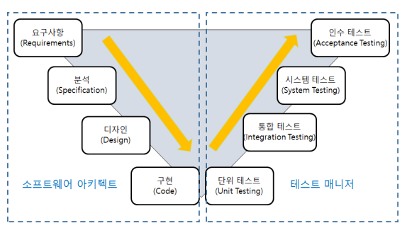

[목록으로](https://github.com/nxx5xxx/study/blob/master/readme.md)
<a href="#abt" style="font-size: 24px;">맨 아래로</a>

# 산업기사 필기정리4
### 소프트웨어의 생명주기 V모델

## 프로젝트 수행단계에 따른 테스트 분류
### 단위테스트
컴포넌트 또는 모듈을 테스ㅌ 하는것, 일반적으로 개발자가 직접한다.
아주 중요한 부분이므로 개발 도구에서 지원하지 않아도 반드시 수행해야 한다.
### 통합테스트
모듈사이의 인터페이스, 통합된 컴포넌트 간의 상호작용을 테스트 하는것
### 시스템 테스트
통합된 단위 시스템의 기능이 시스템에서 정상적으로 수행 되는지를 테스트 하는것, 성능 및 장애테스트가 여기에 포함된다.

### 인수테스트
최종사용자와 업무에 따른 이해관계자 등이 테스트를 수행함으로써 개발된 제품에 대한 운영여부를 결정하는 테스트. 실제 업무 전에 수행한다. 
## 수행 단계에 따른 테스트의 접근방법.
### 단위테스트
1. 구조기반 : 프로그램 내부구조 및 복잡도를 검증하는 화이트박스 테스트
    - 업무단위 별 제어흐름과 조건 결정에 따른 결과를 테스트
2. 명세기반 : 목적 및 실행코드 기반의 실행을 ㅌ오한 블랙박스 테스트
    - 동등분할과 경계값 분석을 위해 사용자의 입력 출력 내부, 이벤트 등을 확인
### 통합테스트
일반적으로 빅뱅 방식보다는 순차적 형태와 아키텍쳐에 대한 이해를 바탕으로 진행한다.
- 빅뱅, 상향, 하향, 샌드위치, Central Collaboration, 레이터 통합 등의 테스트가 있다.
### 인수테스트
1. 사용자 인수 테스트 : 비즈니스 사용자가 시스템 사용의 적절성 여부를 확인
2. 운영상의 인수테스트 : 시스템 관리자가 시스템 인수 시 수행하는 테스트 활동으로 백업/복원시스템, 재난복구, 사용자관리, 정기점검 등을 확인.
3. 계약인수 테스트 : 계약상의 인수/검수 조건을 준수하는지 여부를 확인
4. 규정인수 테스트 : 정부지침, 법규, 규정 등 규정에 맞게 개발하였는지 확인
5. 알파 테스트 : 개발자는 조직 내 잠재고객에 의해 테스트 수행
6. 베타 테스트 : 설치 환경에서 고객에 의해 테스트 수행
## 테스트 기반에 따른 테스트 종류
- 구조기반 : 소프트웨어 내부의 논리 흐름에 따른 테스트 케이스 작성 및 결함을 발견한다.
    - 세부기법 : 구문기반, 결정기반, 조건기반, 조건결정기반, 변경조건기반, 멀티조건 기반 커버리지
- 명세기반 : 사용자의 요구사항 분석서에 주어진 명세를 빠뜨리지않고 테스트 케이스화
    - 세부기법 : 동등분할, 경계값 분석, 결정테이블 테스팅, 상태전이 테스팅, 유스케이스 테스팅
- 경험기반 : 유사 소프트트웨어와 기술에서 테스터의 경험, 직관, 기술능력을 바탕으로 하는 테스트 기법
    - 세부기법 : 탐새적 테스팅, 리스크 기반 테스팅

## 테스트 자동화 도구
테스트 자동화 도구의 사용으로 테스트의 정확성을 유지하면서 시간과 비용을 줄일 수 있다
### 테스트 자동화
- 장점
1. 테스트 재입력과 재구성같은 반복작업의 자동화를 통하여 테스트 인력과 시간을 최소화 한다.
2. 향상된 요구사항 정의, 성능 및 스트레스 테스트, 품질측정 최적화
3. 빌드확인, 회귀, 다중 플랫폼 호환성, 소프트웨어 구성, 기본테스트 등 향상된 품질을 보장한다
- 단점
1. 도입 후 도구전문가 비용, 프로세스 적용시간 등 추가 투자가 필요하다
2. 비공개 SW의 경우 고가이며 인력과 교육에 대한 유지관리 비용이 높다
### 고려사항
1. 재사용 및 측정이 불가능한 테스트 프로그램은 제외해야 한다.
2. 설계기준을 고려하여 반복적인 빌드에서 스크립트 재사용성이 가능해야 한다
3. 완벽한 도구는 없다, 그러므로 용도에 맞는 도구를 사용해야 한다.
4. 도구 습득기간을 고려하여 프로젝트 지연을 방지해야 한다.
5. 테스트 엔지니어의 늦은 투입은 프로젝트의 이해 부족으로 불왅전한 테스트를 초래할 수 있으므로 적절한 계획은 초기에 수립해야 한다.

## 테스트 단계를 지원하는 도구의 종류
<table>
<tr> <th>테스트 활용</th> <th>테스트 도구</th><th>내용</th></tr>
<tr> <td rowspan="2">테스트 분석/설계 
</td><td>1. 테스트 케이스 생성
</td><td>테스트 기법에 따른 테스트 데이터 및 케이스 생성
</td></tr>
<tr><td>2. 커버리지 분석
</td><td>대상 시스템에 대한 테스트 완료 범위의 척도
</td></tr>

<tr> <td rowspan="5">테스트 수행
</td><td>1. 테스트 자동화
</td><td>기능 테스트 등 도구를 활용해 자동화를 통한 테스트의 효율성 제고
</td></tr>
<tr><td>2. 정적분석
</td><td> 코딩표준, 런타임오 오류 등을 검증
</td></tr>
<tr><td>3. 동적분석
</td><td> 대상 시스템 시뮬레이션을 통한 오류 검출
</td></tr>
<tr><td>4. 성능테스트 
</td><td> 가상 사용자를 인위적으로 생성하여 시스템 처리능력 측정
</td></tr>
<tr><td>5. 모니터링
</td><td>시스템 자원(CPU), MEMORY)등 의 상태 확인 및 분석 지원 도구
</td></tr>

<tr> <td rowspan="3">테스트 통제
</td><td>1. 형상관리
</td><td>테스트 수행에 따라 다양한 도구 및 데이터 관리
</td></tr>
<tr><td>2. 테스트 관리
</td><td>전박적인 테스트 계획 및 활동에 대한 관리
</td></tr>
<tr><td>3. 결함 추적/관리
</td><td> 테스트에서 발생한 경함 및 협업 지원
</td></tr>
</table>

## 결함관리
### 결함
1. 결함은 프로그램과 명세서 간의 차이, 업무내용 불일치 이다.
2. 결함은 기대 결과와 실제 관찰 결과간의 차이 이다.
3. 시스템이 사용자가 기대하는 타당한 기대치를 만족시키지 못할 때 변경이 필요한 모든것은 결함이다.

### 결함관리 프로세스
결함관리 계획 > 기록 > 검토 > 수정 > 재확인 > 최종결함 분석 및 보고서 작성
1. 결함 관리 계획 : 결함 관리 계획은 전체 프로세서에 대한 일정, 인력, 업무 프로세스를 확보하여 계획은 수립하는 것
2. 결함 기록 : 테스터는 발견된 결함에 대한 정보를 결함관리 DB에 기록한다.
3. 결함 검토 : 등록된 결함에 있어서 주요 내용을 검토하고, 결함을 수정할 개발자에게 전달한다.
4. 결함 수정 : 개발자는 할당된 결함의 프로그램을 수정한다.
5. 결함 재확인 : 테스터는 개발자가 수정한 내용을 확인하고 다시 테스트를 수행한다.
6. 결함 상태 추적 및 모니터링 활동 : 팀장은 결함관리 DB를 이용하여 대시보드 또는 게시판 형태의 서비스를 제공한다.
7. 최종결함 분석 및 보고서 작성 : 발견된 결함에 대한 내용과 이해관계자들의 의견이 반영된 보고서를 작성하고 결함관리를 종료한다.
### 결함분류
1. 시스템 결함 : 비정상적인 종료/ 중단, 응당시간 지연, 데이터베이스 에러 등 주로 애플리케이션 환경과 DB처리에서 발생하는 결함을 말한다.
2. 기능 결함 : 사용자의 요구사항 미반영/ 불일치, 부정확한 비즈니스 프로세스, 스크립트 에러, 타시스템 연동 시 오류 등 기획, 설계, 업무 시나리오 단계에서 발생된 결함
3. GUI결함 : 응용 프로그램의 UI 비 일관성, 부정확한 커서/ 메시지, 데이터 타입의 표시오류 등으로 사용자 화면설계에서 발생된 결함
4. 문서 결함 : 기획자, 사용자, 개발자 간의 의사소통과 기록이 원할하지 않은경우 발생하는 경함

## 애플리케이션 결함 조치하기
### 소프트웨어 테스트 기법
1. 단위 테스트 기법
- Junit을 활용한 테스트
- Mock테스트 : 테스트 더블이라 불리는 Mock 객체를 사용하는 테스트 기법이며 특정 기능 또는 모듈에 대한 응답결과를 미리 정의해놓고 테스트한다. 이는 특정 모듈이나 기능이 완벽히 개발완료 되지않은 상태에서도 가능하다.  
2. 통합 테스트 기법
- 전체 시스템이 통합 완료될 때 까지 단위 시스템 간의 연계성 및 요구사항 들을 확인하고, HW와 SW 구성요소간의 상호작용을 테스트 하는것이 주요 목적이다
3. 시스템 테스트 기법
- 부하 및 성능 테스트 : 동시 접속으로 시스템에 많은 요청(업데이트, 조회) 등이 발생할때 어떻게 가동되는지 확인하는 테스트
- 장애복구 테스트 : 하드웨어 장애, 네트워크 정전, 운영오류 와 같이 각종 장애 상황 복구 및 재가동 테스트
- 보안 테스트 : 최신 기술이 반영된 검증 필요
4. 인수테스트 기법
- 최종 사용자가 요구한 기능이 제대로 반영 되었는지, 인수조건에 만족하는 지를 테스트 하는 기법이다. (고객이 주도하는 테스트)
### 결함 단계의 이해
- 결함관련 용어 
1. 에러(Error) : SW개발 또는 유지 보수 중 발생, 개발자의 오타, 개발 명세서 부정확한 이해, 서브루틴 기능 오해 등
2. 오류(Fault) : 프로그램 코드상 존재하며 버전차이로 인해 발생된다, 잘못된 연산자가 사용된 경우에는 프로그램 서브루틴으로 부터 에러리턴을 점검하는 코드가 누락된 경우
3. 실패(Failure) : 실패 실행 결과와 개발 명세서 예상결과 비교
4. 결함(Defect) : 버그, 에러, 오류, 실패, 프로그램 실행에 대한 문제점, 개선사항 등의 전체 포괄 용어
### 결함의 판단 기준
1. 기능명세서 상 가능하다 명시된 동작이 수행되지 않을경우
2. 기능명세서에 불가능하다 명시된 동작이 수행되는 경우
3. 명시되어 있지않은 기능을 수행하는 경우
4. 명세서 상에는 있지만 수행해야 할 동작을 수행 안하는 경우
5. 테스터 시각에서 볼때 문제가 있다고 판단되는 경우

## 결함 조치 관리
인스펙션과 워크스루의 차이점
<table>
    <tr><th></th><th>인스펙션</th><th>워크스루</th></tr>
    <tr><td> 목적
    </td><td> 결함 파악 및 제거
    </td><td> 산출물 평가 및 개선
    </td></tr>
    <tr><td> 수행조건
    </td><td> 완성도가 기준 이상일 때
    </td><td>팀이나 관리자의 필요시
    </td></tr>
    <tr><td> 결함 수정 여부
    </td><td>모든 결함은 제거 되어야 한다
    </td><td>저자가 결정한다
    </td></tr>
    <tr><td>변경사항 검증
    </td><td>진행자가 재작업결과를 확인
    </td><td>저자가 결정한다
    </td></tr>
    <tr><td>검토자 인원
    </td><td>3-6명
    </td><td>2-7명
    </td></tr>
    <tr><td>참여자
    </td><td>동료
    </td><td>기술 전문가 및 동료
    </td></tr>
    <tr><td>검토 인도자
    </td><td>교육받은 진행자(Moderator)
    </td><td>저자
    </td></tr>
    <tr><td>검토 준비 여부
    </td><td>체크리스트를 이용한 검토
    </td><td>일반적으로 검토 준비하지 않는다
    </td></tr>
    <tr><td>검토분량
    </td><td>상대적으로 적다
    </td><td>상대적으로 적다
    </td></tr>
    <tr><td>검토속도
    </td><td>상대적으로 느리다
    </td><td>빠르다
    </td></tr>
    <tr><td>발표자
    </td><td>산출물에 의존도가 높은사람(Reader)
    </td><td>저자
    </td></tr>
    <tr><td>자료 수집 여부
    </td><td>모든 검토자들이 기록한다
    </td><td>하지 않는다
    </td></tr>
    <tr><td>보고서
    </td><td>결함리스트 및 측정지표
    </td><td>워크스루 보고서
    </td></tr>
    <tr><td>데이터 측정여부
    </td><td>필수
    </td><td>권장사항
    </td></tr>
    <tr><td>체크리스트 사용여부
    </td><td>사용한다
    </td><td>사용하지 않는다
    </td></tr>
</table>

## 형상관리 및 구성요소
### 소프트웨어 형상관리의 정의
1. 소프트웨어 프로세스의 모든 출력물 정보
2. 컴퓨터 프로그램, 컴퓨터 프로그램 설명 문서, 데이터
3. 소프트웨어 프로세스 전반에 걸쳐 소프트웨어 형상의 변경 요인에 대해 소프트웨어 형상을 보호하는 활동

### 기준선과 소프트웨어 형상 항목
1. 기준선(BaseLine) : 변경을 통제하게 도와주는 기준선은 정식으로 검토 및 합의된 명세서와 제품 개발의 바탕으로서 정식 변경 통제 절차를 통해서만 변경이 가능하다.
2. 소프트웨어 형상항목 : Software Configuration Item - 소프트웨어 형상과 개발도구의 합성

### 형상 관리의 주요 활동
1. 형상 관리 기능
형상을 식별하고 관리하는것이 주 이다.
- 단계별 형상 관리 기능
<table>
    <tr><th>단계</th><th>설명</th></tr>
    <tr><td>형상 식별
    </td><td>형상 관리 대상을 구분하고 관리 목록 번호 부여
    </td></tr>
    <tr><td>버전 관리
    </td><td>진화 그래프 등을 통해 SCI의 버전 부여/갱신
    </td></tr>
    <tr><td>변경 통제
    </td><td>SCI에 대한 접근 및 동기화 제어
    </td></tr>
    <tr><td>형상 감사
    </td><td>SCI 무결성을 평가하여 공식적으로 승인
    </td></tr>
    <tr><td>상태 보고
    </td><td>개발자와 유지 보수자에게 변경 사항을 공지
    </td></tr>
</table>

2. 형상 식별 : SW 형상 항목에 대해 식별하고 고유한 이름을 부여하는 활동
<table>
    <tr><th>식별자 항목</th><th>내용</th></tr>
    <tr><td>이름(name)
    </td><td>객체 명
    </td></tr>
    <tr><td>서술(description)
    </td><td>SCI 타입, 프로젝트 식별자, 버전 정보
    </td></tr>
    <tr><td>지원(list of resource)
    </td><td> 제공/처리/참조/요구되는 객체
    </td></tr>
    </td></tr>
    <tr><td>실현(realization)
    </td><td>기본 객체인 경우 - 단위 텍스트에 대한 포인터 실현
    </td></tr>
</table>

3. 버전관리
여러 버전의 형상 객체를 관리하기 위한 절차와 도구, 그리고 형상 항목의 여러 버전을 표현하는 기능을 구성 할 수 있다.

4. 변경 통제에 대한 업무별 활동
변경 요청에 대해 프로세스에 어떠한 영향이 있는지 확인하는 과정

[목록으로](https://github.com/nxx5xxx/study/blob/master/readme.md)
<a href="#" style="font-size: 24px;" id="abt"> 상단으로 </a>