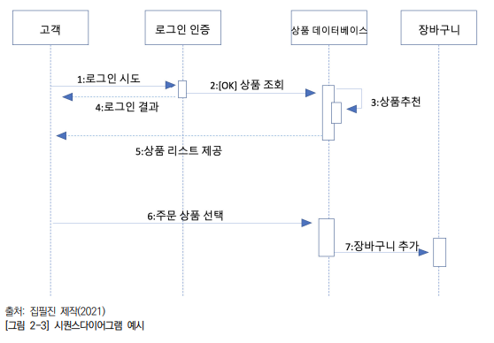

[목록으로](https://github.com/nxx5xxx/study/blob/master/readme.md)
<a href="#abt" style="font-size: 24px;">맨 아래로</a>

# 산업기사 필기정리6
## 프로그래밍 언어활용
### 구조적 프로그래밍
> 구조화 프로그래밍 이라고도 하며 절차적 프로그래밍 기반 아래 만들어진 프로그래밍 기법으로 프로그램을 결합하는 순차, 분기, 반복 구조를 통해 설계된다

#### 구조적 프로그래밍 설계구조
1. **순차구조** : 위에서 아래로 실행되는 구조 작은단위로 나뉜 후 순서대로 진행되는 구조
2. **선택구조** : if, if~else 와 같이 참 - 거짓에 따라 처리가 분기되는 구조
3. **반복구조** : 조건이 만족할 때 까지 반복 while, for 등

#### 구조적 프로그래밍 개발절차
1. **요구사항 분석** : 고객이 원하는 요구사항을 수집하여 명세화 하는 단계
2. **구조적 분석** : 고객이 원하는 기능, 시스템 환경, 데이터를 종합하여 데이터흐름도(Data Flow Diagram)를 작성하는 단계, 대표적인 기법으로는 ERD, DFD 등 이 있다.
3. **구조적 설계** : 모듈 중심으로 설계하는 단계 재활용, 결합도를 낮춰 독립성은 높이는 단계
4. **구조적 프로그래밍** : 순차, 선택, 반복의 논리구조를 구성하여 프로그램 복잡성을 최소화 하여 프로그래밍하는 단계

#### 구조적 프로그래밍 구성요소
1. **데이터 흐름도(DFD - Data Flow Diagram)** : 데이터 각 기능을 분할하여 표현한 구조도. 특정프로세스를 구성하는 하위프로세스들 사이의 데이터 이동을 보여준다. 최하위 수준으로 작성된 DFD는 각 프로그래머가 모듈에 대응하여 개발한다.
2. **자료사전(DD - Data Dictionary)** : DFD에 표현된 자료를 구체적으로 명시하기 위해 사용되는 도구 프로그램에서 사용하는 모든 데이터의 표준명칭, 의미, 형식, 길이, 용도, 원천등을 정의
3. **상태전이도(STD - Store Transition Diagram)** : 보통 어떤 상태에서 다른상태로 전이되는 과정 및 해당과정의 프로세스 명세를 작성하는 다이어그램
4. **소단위명세(Mini spec - mini specification)** : 나눌 수 없는 부분까지 기능을 분리하여 작성한 명세서, 구조언어를 사용하거나 N-S Chart를 이용한다.

---

### 객체지향 프로그래밍언어 활용하기
#### 객체지향 속성
1. **캡슐화** : 객체의 속성과 행위를 하나로 묶고, 실제 구현내용 일부를 외부에 감추어 은닉하는 기법. 외부객체는 객체 내부의 구조를 알지 못하게 하고, 내부 객체에서 제어하여 제공하는 필드와 메소드만 이용할 수 있다.
2. **추상화** : 어떤 실체로 부터 공통적인 부분이나 관심있는 특성들만 하나로 모은것. 하위 클래스들에 존재하는 공통적인 메소드를 인터페이스로 정의하는것도 포함된다.
3. **다형성** : 같은 모양의 함수가 상황에 따라 다르게 동작하는것을 의미
    - **오버로딩** : 함수이름은 같으나 함수의 매개변수, 개수, 타입등을 다르게 하여 사용하는 기법
    - **오버라이딩** : 상위클래스의 메소드를 하위클래스에서 똑같은 이름으로 재정의 하는것
4. **정보은닉** : 캡슐화 정보를 밖에서 접근 못하게 하는것. 프로퍼티(변수)와 메소드(함수)가 하나의 캡슐안에 묶임
5. **상속성** : 부모클래스에서 새로운 기능을 추가해 자식클래스로 만들어 사용하는 기법

#### 객체지향 설계 원칙
1. **단일책임원칙(Single Responbility principle)** : 모든 클래스는 각각 하나의 책임만 갖어야 한다. 클래스는 그 책임을 완전히 캡슐화 해야함을 뜻한다.
2. **개방-폐쇄원칙(open closed principle)** : 확장에는 열려있고 수정에는 닫혀있어 기존의 코드를 변경하지 않고 기능을 추가할 수 있도록 설계가 되어야 한다는 원칙
3. **리스코프 치환원칙(Liskov subtitution principle)** : 자식 클래스는 자신의 부모클래스를 대체할 수 있다는 원칙, 부모클래스가 들어갈 자리에 자식클래스를 집어넣어도 잘 작동해야한다. 부모클래스의 책임을 무시하거나 재정의 하지않고 확장만 수행하도록해야 만족한다.
4. **인터페이스 분리법칙(Interface segregation principle)** : 자신이 사용하지 않는 인터페이스(메소드)를 구현하지말고 여러개로 나눠 필요한것만 사용
5. **의존역전 원칙(Dependency Inversion prinsiple)** : 변화가 없는것에 의존해야 한다는 원칙. 구체적인 클래스보다 인터페이스나 추상클래스와 관계를 맺어야하는 원칙

#### UML통합모델링언어(Unified Modeling Language)
> 객체지향 프로그래밍 SW집약시스템 개발할때 산출물을 명세화 시각화, 문서화 할때 사용한다.

1. **유스케이스 다이어그램** : 요구분석, 시스템설계, 시스템구현 등의 시스템 개발 과정에서 개발자 간의 의사소통이 원할하게 이뤄지도록 표준화한 대표적인 객체지향 모델링언어
2. **클래스 다이어그램** : 클래스 다이어그램은 UML 구조 다이어그램으로서 클래스 내부 구성요소 및 클래스 간의 관계를 도식화하여 시스템의 특정모듈이나 일부또는 전체구조를 나타낸다.
    - **속성(attribute)** : 보통명사형, 실제 구현된 클래스를 기준으로 어트리뷰트는 클래스의 멤버변수로 사용된다.
    - **행동(operation)** : 다이어그램에서 가장 하단에 위치해 있으며 해당 클래스가 수행할 수 있는 오퍼레이션들을 가진다.
3. **시퀀스다이어그램** : 문제 해결을 위한 객체를 정의하고 객체간의 상호작용 메시지 시퀀스를 시간의 흐름에 따라 나타내는 다이어 그램이다.
    - **활성객체** : 시스템 행위자 혹은 시스템 내의 유효한 객체 라이프라인(Life line)을 가진다.
    - **메시지** : 서로 다른 객체간의 상호작용 혹은 의사소통 통신을 정의하는 요소. 자신의 객체 라이프 라인으로부터 다른 객체 라이프라인까지 선+화살표로 표시되며 메시지는 그 선위에 표시된다.
    - **활성박스** : 객체 라이프라인 위에 그려지는 박스로 이 박스위에서 객체의 호출이 이루어진다. 객체의 특정메소드 실행 혹은 정보처리가 실행되고 있거나 다른 객체의 메소드가 종료되기를 기다린다는것을 나타낸다.
  

---

### 객체지향 프로그래밍 언어 활용
1. **클래스(class)** : 같은 종류의 집단에 속하는 속성과 행위, 객체지향 프로그램의 기본적인 사용과정의 데이터형
    - 일반적으로 클래스 이름과 소스파일명은 동일하다.
    - 프로그램은 여러클래스로 구성되며 실행을 위해서는 main()메소드를 사용한다.
2. **객체(object)** : 클래스의 인스턴스로 자신 고유의 데이터를 가지며 클래스에서 정의한 행위를 수행할 수 있다.
    - main() 메소드는 프로그램이 실행하는 진입점이고 실제 클래스를 사용하려면 new() 연산을 통해 인스턴스를 생성한다.
    - main() 에서 클래스부에 선언된 변수를 접근할 수 없으며 인스턴스를 통해 사용한다.
    - 인스턴스에서 변수와 메소드 사용은 인스턴스명 다음에 변수명, 인스턴스명, 메소드명과 같은 형식으로 사용된다. ex) Test t = new Test(); int i = t.number1; t.rrr(i);
3. **메소드(Method)** : 클래스로 부터 생성된 객체를 사용하는 방법으로 특정기능을 수행하면서, 객체에 명령을 내리는 기능을 갖고있다.
4. **속성(property)** : 한 클래스 내에 속한 객체들이 가지고있는 데이터 값을 단위별로 정의한것. 성질이나 분류 또는 현재 상태 등에 대한 표현값을 갖고있다.

#### 접근지정자
1. **public** : 모든 접근을 허용하는 접근자. 공개적으로 오픈 할 때 사용하는 접근자.
    - 같은 패키지가 아니여도, 상속하지 않아도 접근 허용
2. **protected** : 자기 자신클래스 및 상속받은 자식 클래스에서의 접근을 허용하는 접근자
    - 같은 패키지 일경우 상속받지 않아도 사용이 가능하다
    - 다른패키지의 경우 상속받아 사용한다
3. **default** : 접근 지정자를 명시하지 않는경우 기본값. 
   - 같은 패키지에서는 접근이 가능하다
   - 다른 패키지에서 상속받은 경우에조차 접근이 불가능하다.
4. **private** : 자기 자신 클래스 내부의 메소드만 접근을 허용하는 접근자.

#### 변수유형
1. **멤버변수(Member Variable)** : 클래스부에 선언된 변수들로 객체의 속성에 해당하고, 인스턴스 변수와 클래스 변수로 구분한다.
2. **인스턴스 변수(Instance Variable)** : 클래스가 인스턴스될 때 초기화되는 변수로서 인스턴스를 통해서만 접근할 수 있다 (Test t = new Test() 요놈이 인스턴스)
3. **매개변수(Parameter)** : 메소드에 인자값을 전달받기 위한 변수
4. **지역변수(Local Variable)** : 메소드 내에 선언된 변수 멤버변수와 동일한 이름이 가능하다.
5. **클래스변수(Class Variable)** : static으로 선언, 인스턴스 생성없이 클래스 이름의 변수명으로 사용가능하고, main()메소드에서 참조 가능하다.

---

### 스크립트 언어 활용하기
#### 스크립트 언어
> 응용 소프트웨어를 제어하는 컴퓨터 프로그래밍 언어이다. 초창기 스크립트 언어는 배치언어 또는 제어언어 라고도 불렸다.

> 스크립트 언어는 응용프로그램과 독립하여 사용되고 다른 응용프로그램의 언어와 다른 언어로 사용되어. 최종사용자가 응용프로그램의 동작을 사용자의 요구에 맞게 수행할 수 있도록 해준다.

1. **인터프리터 언어** :  코드를 작성함과 동시에 인터프리터가 기계어로 번역하고 실행한다.
2. **단순한 구문** : 스크립트 언어는 타 프로그래밍 언어에 비해 단순한 구문과 의미를 내포한다.
3. **컴파일 시간 소요** : 스크립트 언어는 컴파일된 프로그램보다 실행 시간이 오래걸린다, 다른 프로그램에 의해 전 처리가 필요하기 떄문.
4. **신속한 활용** : 일반적으로 스크립트 언어는 빠르게 배우고 작성하기 위해 고안된 언어이다.

#### 기능설계서와 화면설계서
1. **기능설계서** : 예를들어 기능을 작동하게 하기위해 정의된 기능 설계서에는 무엇을, 어떻게 만드는지 정의되어 있다. 설계서는 '무엇을' 만들 것인지 초점을 두어 작성이 되어있고, 개발자는 기능 명세서를 보고 전체 구조와 설계를 함께 고려하여 '어떻게'를 개발한다.
2. **화면 설계서** 
- **화면설계서 유형**
   - 화면 설계서 유형은 파워포인트, 스토리보드, 와이어 프레임, 목업 등이 있다.
    - **와이어 프레임** : 기획단계에서 페이지 레이아웃이나 화면 이동, 구성요소에 대한 내용을 기술한 문서이다.
    - **스토리 보드** : 와이어 프레임의 내용에 디스크립션 등을 포함한 설계 문서이다.
    - **목업** : 설계 단계에서 실제 화면과 같은 형태의 모형이다.
- **프로토타입** : 인터랙션(Interaction : 상호작용) 이 포함되어 테스트가 가능한 형태이다.
- **UI 디자인** : 화면의 모양이나 기능 등을 표현하는 것이다.

#### 스크립트 프로그래밍 언어 유형
1. Javascript : 미국 넷스케이프사가 개발한 스크립트 프로그래밍 언어. 표준HTML 문서 내에 삽입되어 사용되며 인터랙티브한 웹 페이지를 만들 수 있다.
2. jQuery : HTML 문서에서 사용할 수 있는 자바스크립트의 라이브러리이다.
3. JSP(JavaServer Pages) : HTML 웹페이지 클라이언트에 자바코드를 직접 삽입하여 웹 서버에서 동적으로 웹페이지를 생성하여 웹 브라우저에서 표현할 수 있도록 전달해주는 스크립트 프로그래밍 언어이다.
4. PHP(Hypertext Preprocessor) : HTML문서 안에 포함하여 작동하는 서버 측 스크립트 프로그래밍 언어이다. 리눅스 운영체제에 아파치 웹 서버를 설치하고 MySQL DB환경에서 주로 같이 사용된다.
5. ASP(Avtive Server Pages) : 마이크로소프트사에서 개발된 윈도 서버에서 운영할 수 있도록 개발된 스크립트 방식의 웹프로그래밍 언어이다.
6. Python : 객체지향 스크립트 프로그래밍 언어로 별도의 컴파일 과정이 필요없다. 그로인해 개발 시간이 단축되고 리눅스나 윈도 등 특정 플랫폼에 의존적이지 않고 독립적이다.
7. VBScript : 마이크로소프트 Visual Baisc 기반의 스크립트 프로그래밍 언어

#### 스크립트 프로그래밍 원리
1. 스크립트 코드 작성 : 최초 스크립트 코드를 작성
2. ByteCode변환 : 스크립트 엔진은 인터프리터 방식으로 위에서부터 한줄 씩 해석하면서 가상머신이 이해할 수 있는 Byte code로 변환한다.
3. 기계어 변환 : 가상머신은 Byte code를 CPU가 이해할 수 있는 기계어로 변환한다. 단, CPU 마다 기계어를 다르게 해석하므로 가상 머신은 CPU별로 최적화된 기계어를 만들어낸다.
4. CPU 코드 변환 : CPU는 가상 머신이 만들어낸 기계어를 수행한다. 기계어대로 메모리에 데이터를 저장하고, 읽고, 연산하고, 출력하는 작업등을 수행한다.

[목록으로](https://github.com/nxx5xxx/study/blob/master/readme.md)
<a href="#" style="font-size: 24px;" id="abt"> 상단으로 </a>