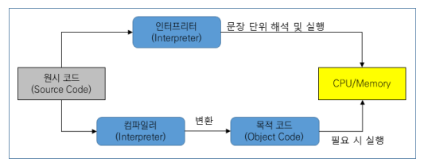
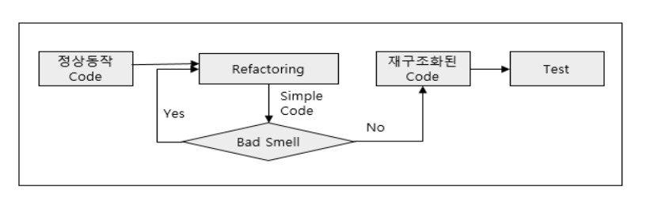

[목록으로](https://github.com/nxx5xxx/study/blob/master/readme.md)
<a href="#abt" style="font-size: 24px;">맨 아래로</a>

# 산업기사 필기정리5
## 프로그래밍 언어의 유형 분류
#### 개발 편의선 측면에 따른 분류
1. **저급언어** : 컴퓨터가 직접 이해할 수 있는 언어. 실행속도가 빠르며 기계마다 언어가 달라 호환성이 없어 유지보수가 어렵다.
2. **고급언어** : 개발자가 이해할 수 있도록 소스코드를 작성 할 수 있는 언어. 실행을 위해서는 번역과정이 필요하다

#### 실행 및 구현 방식에 따른 분류
1. **명령형 언어** : 컴퓨터가 동작해야 할 알고리즘을 해 프로그래밍 상태를 변경시키는 구문에 중점을 둔 방식 FORTRAN, C, COBOL, PASCAL 등
2. **함수형 언어** : 함수의 응용을 강조하면서 자료의 처리는 수학적인 함수의 연산으로 취급하고, 상태와 가변 데이터는 멀리하는 방식 LISP, SCALA, ELRANG, SCHEME 등
3. **논리형 언어** : 논리 문장을 이용하여 프로그램을 표현하고 조건이 만족되면 연관된 규칙이 실행되는 방식 PROLOG
4. **객체지향언어** : 객체간의 메시지 통신을 이용하여 동작하는 방식 JAVA, C++, SMALLTALK, PYTHON 등

#### 빌드 방식에 따른 분류
1. **컴파일 언어** : 소스코드가 기계어 실행파일로 빌드되는 방식 C, C++ 등 , 실행속도가 빠르다
2. **인터프리터 언어** : 소스코드를 한줄 식 번역하며 실행, 실시간 분석이 가능하다 - PYTHON
3. **바이트코드 언어**: 컴파일을 통해 가상머신이 번역 할 수 있는 BYTE CODE로 변환되어 가상머신은 다시 NATIVE OS가 이해 할 수 있는 기계어로 번역하는 방식 JAVA, SCALA

---

### 컴파일러와 인터프리터
고급언어로 작성한 소스코드의 경우 컴퓨터가 이해할 수 없으므로 컴파일러나 인터프리터를 이용하여 컴퓨터가 이해하고 실행할 수 있는 기계어 코드로 번역을 수행
##### 동작방식

#### 컴파일러와 인터프리터 비교
<table>
<tr><th>구분
</th><th>컴파일러
</th><th>인터프리터
</th></tr>
<tr><td>개발 편의성
</td><td>코드를 수정하고 실행이 필요한 경우 재컴파일 필요
</td><td>코드 수정 후 즉시 실행가능
</td></tr>
<tr><td>번역 단위
</td><td>전체 소스 코드
</td><td>문장 단위
</td></tr>
<tr><td>실행 파일 및 속도
</td><td>실행 파일 생성, 처리속도가 빠르다
</td><td>실행파일 미생성, 처리속도가 느리다
</td></tr>
<tr><td>메모리 할강
</td><td>실행파일 생성시 사용
</td><td>할당하지 않음
</td></tr>
<tr><td>오류확인 및 처리
</td><td>전체코드에 대한 컴파일 수행 시 발생한 오류 확인이 가능하다
</td><td>프로그램 실행 후 오류가 발생한 문장 이후의 코드는 실행되지 않는다
</td></tr>
<tr><td>파일 용량 및 보안
</td><td>실행 파일 전체를 처리해야 하므로 용량이 크며, 원시코드의 유출가능성이 상대적으로 낮다
</td><td>원시코드만 처리하면 되므로 용량이 상대적으로 작고, 원시코드의 유출가능성이 높다
</td></tr>
<tr><td>주요언어
</td><td>C,C++,JAVA
</td><td>Python, Javascript, Ruby
</td></tr>
</table>

---

### 객체지향의 구성요소와 특징
>Instance : 클래스에 소속된 개별적인 객체
#### 구성요소
1. 객체(Object) : 개체와 속성, 메소드로 구성된 클래스의 Instance
2. 클래스(Class) : 공통된 특성(속성, 연산)을 가지는 객체 집합, 객체 타입을 정의하고 생성하는 틀
3. 메시지 : 객체간의 상호작용은 메시지를 통해 이뤄지며 메시지는 객체에서 객체로 전달
#### 객체지향의 특징
1. 캡슐화(Encapsulation) : 연관된 데이터와 데이터를 처리하는 함수를 함께 묶어 외부에 필요한 인터페이스만 노출.
2. 정보은닉(Information Hiding) : 다른 객체에서 자신의 필드 및 메소드 등을 은닉하고 자신의 연산만을 통하여 접근을 허용한다.
3. 추상화(Abstraction) : 불필요한 부분은 생략하고 주어진 문제나 시스템 중에서 중요한 부분에 집중하여 모델링
4. 상속(Inheritance) : 하위클래스에서 상위클래스의 속성과 메소드를 물려받는 기법으로 클래스와 객체의 재사용이 가능하다
5. 다형성(Polymorphism) : 하나의 메시지에 대해 각 객체의 고유한 방법으로 응답한다

---

### 프로그램 언어 별 설명 및 특성
<table>
<tr><th> 프로그램 언어
</th><th> 설명및 특성
</th></tr>
<tr><th>FORTRAN
</th><td>IBM에서 만듬, 많은 관련지식이 필요하며, 기상예측, 자원탐사, 우주항공, 유체 및 구조해석 등의 과학 계산 전문 분야에 활용한다.
</td></tr>
<tr><th>COBOL
</th><td>미국 궁방성에 의해 개발. 비즈니스, 금융, 회사/장부 관리시스템에 주로 사용. 메인프레임 컴퓨터의 레거시 응용프로그램 들에 사용되고 있으며 크기가 크고 구문이 복잡하다
</td></tr>
<tr><th> PASCAL
</th><td> 잘 짜인 구조와 간결성으로 프로그래밍 교육을 위해 널리 사용된다 
파스칼+객체지향 = OBJECT PASCAL =진화=> DELPHI
</td></tr>
<tr><th>C
</th><td>유닉스 운영체제 구현에 사용되며 효율적인 실행, 간결한 문법, 효과적인 포인터 타입 제공이 특징이다
</td></tr>
<tr><th>C++
</th><td>C언어에서 발전 되었으며  다중상속 등의 기능을 제공하는 객체지향 언어이다
</td></tr>
<tr><th>C#
</th><td>C와 C++의 발전,.NET환경에 맞게 설계 되었으며 UI를 쉽게 만들 수 있는 컴포넌트를 제공한다
</td></tr>
<tr><th>PHP
</th><td>웹 개발 특화언어, 다양한 프레임워크지원, 특별한 컴포넌트 설치를 하지 않아도 다양한 처리가 가능하다
</td></tr>
<tr><th>JAVA
</th><td>C++에 비해 단순하고 분산환경과 객체지향, 보안성을 지원하고 컴파일을 통해 class파일을 생성하며 가상머신인 JVM에서 실행한다
</td></tr>
<tr><th>JAVASCRIPT
</th><td>HTML, CSS와 함께 웹을 구성하는 핵심 요소로 거의 모든 웹 브라우저에 스크립트엔진(인터프리터)가 존재. 웹페이지의 동작 구현이 가능하고 빠른 개발과 확장성이 뛰어나지만 다른언어에 비해 보안이나 성능이 부족하다.
</td></tr>
<tr><th>Python
</th><td>배우기 쉽고 이식성이 좋은언어, 다양한 함수들도 많이 제공되어 최근 트랜드와 맞물려 스타트업과 글로벌 기업등에서 많이 사용하는 언어이다
</td></tr>
<tr><th>GOLANG
</th><td>GOOGLE에서 만든언어로 GO라고도 한다. 내장 라이브러리가 많이 지원되고 C언의 문법과 유사하나 제어구조를 갖고 빠른 컴파일이 가능하다
</td></tr>
<tr><th>KOTLIN
</th><td>JAVA보다 간결한 문법을 가지고 있는 JVM 기반의 언어로 JAVA와 상호 운용이 100% 지원됨. 2019년 구글이 안드로이드의 공식 언어로 추가했다
</td></tr>
<tr><th>R
</th><td>통계 및 그래프 작업을 위한 인터프리터 프로그래밍 언어로 수많은 통계 관련 패키지가 개발되어 있고 빅데이터 분석 및 기계학습 등에 유용하다
</td></tr>
</table>

---

### 어플리케이션 구현 및 최적화
#### 1. 코드인스펙션
> 중재자, 저자, 진행자, 검토자, 기록자 등 역할 담당자를 지정하여 진행.
초기단계에 결함을 식별해 오류를 수정함 으로써 오류로 인한 비용최소화, 코드 품질향상, 유사결함의 발생예방 및 유지보수 호율성 향상이 목적이다.

##### 인스펙션 수행절차 및 수행내용
<table>
<tr><th>단계 
</th><th>수행내역
</th></tr>
<tr><th>계획(Planning)
</th><td>인스펙션 대상 산출물 선정 및 대상자를 구성, 인스펙션 대상 산출물을 사전에 배포하고 날짜와 시간 및 장소를 공지한다.
</td></tr>
<tr><th>개관(Overview)
</th><td>참여자를 대상으로 산출물에 대한 이해도를 높여 인스펙션의 효과성을 향상 시킬 수 있으며 생략 가능하다.
</td></tr>
<tr><th>준비(Preparation)
</th><td>구성원이 개별적으로 산출물에 대해 숙지, 체크리스트를 활용해 결함부분에 대해 기록한다
</td></tr>
<tr><th>검토회의(Meeting)
</th><td>산출물을 함께 검토하며 준비단계와 검토회의에서 식별된 결함 부분에 대해 집중한다.
</td></tr>
<tr><th>재작업(Rework)
</th><td>검토회의에서 발견된 결함에 대해 수정한다
</td></tr>
<tr><th>추적(Follow-up)
</th><td>결함이 정상적으로 수정되었는지 최종확인하고 인스펙션을 종료한다.
</td></tr>
</table>

##### 코드리뷰 기법 비교
- **동료검토** : 시간의 정함없이 임의로 개발자가 동료와 코드 및 산출물의 결함을 식별하는 기법
- **워크스루** : 개발자가 리뷰 주제, 시간을 정해 발표를 하고 동료들로 부터 의견이나 아이디어를 듣는 시간을 가질 수 있으며, 사례에 대한 정보공유나 아이디어 수집을 위해 사용된다
- **인스펙션** : 역할과 절차, 체크리스트를 기준으로 결함을 식별하는 공식적인 리뷰기법

#### 2. 리팩토링
> SW의 원래 기능은 유지하면서 소스코드의 내부구조를 수정 보완하여 가독성, 성능향상 및 로직을 개선하는 기법

##### 주요 리팩토링 대상 및 방법
1. 중복된 코드 : 중복을 제거해야한다
2. 긴 메소드 : 메소드를 적정 수준의 크기로 나누어야 한다.
3. 긴 파라미터 리스트 : 리스트의 개수를 줄여야 한다.
4. 게으른 클래스 : 자식클래스와 부모 클래스의 차이가 없으면 합친다
5. 주석 : 주석이 없어도 코드를 이해할 수 있도록 소스코드를 변경한다.
6. 메시지 체인 : 특정 객체를 얻기 위한 다수 객체는 간소화 한다.
7. 미들 맨 : 다른 클래스로 위임하는 역할만 담당하는 클래스 제거를 검토한다.
8. 불완전 라이브러리 : 불완전 시 필요 부분 추가 구성한다.
9. 스위치 명령문 : 지나치게 많은 CASE를 사용하는 Switch 문장은 코드 중복의 신호이다.

##### 리팩토링 수행절차
Badsmell 이 있는 부분을 지속적으로 개선 및 재구조, Badsmell은 PMD와 코드 인스펙션 등을 이용하여 식별할 수 있다

#### 3. OWASP TOP 10
> The Open Web Application Security Project 는 웹 애플리케이션에 대한 보안 프로젝트
> 그 중 취약점에서 빈도가 많이 발생하고 보안상 영향을 크게 줄 수 있는 10가지

<table>
<tr><th>항목
</th><th>상세내용
</th></tr>
<tr><td>Injection(인젝션)
</td><td>비정상적인 명령어나 Query등을 보내 공격자가 시스템에 불법적으로 접근할 수 있는 취약점
</td></tr>
<tr><td>Broken Authentication(취약한 인증)
</td><td>잘못 구현된 인증이나 session 관리 기능으로 인해 일시적 혹은 영구적으로 공격자가 다른 사용자의 권한을 획득할 수 있는 취약점
</td></tr>
<tr><td>Sensitive Data Exposure(민감한 데이터 노출)
</td><td>개인 식별 정보나 신용 정보 등의 민감 데이터 저장 및 전송 시 노출 취약점
</td></tr>
<tr><td>XML External Entities(XXE)(XML 외부 개체)
</td><td>XML문서에서 Excternal Entities를 이용하여 외부 URL을 실행시켜 서버의 로컬 정보를 출력하거나 서비스 거부공격을 수행할 수 있는 취약점
</td></tr>
<tr><td>Broken Access control(취약한 접근통제)
</td><td>다른사용자의 계정접근, 중요데이터 열량 및 수정, 액세스 권한 변경 등 악위적 행위가 가능한 취약점
</td></tr>
<tr><td>Security misconfigurations(잘못된 보안 구성)
</td><td>안전하지 않은 구성, 잘못된 구성으로 HTTP Header나 민감 정보가 포함된 에러 메시지 등으로 인한 취약점
</td></tr>
<tr><td>Cross Site Scripting(XSS)(크로스 사이트 스크립팅)
</td><td>웹 페이지에 악성스크립트를 삽입할 수 있는 취약점 사용자의 정보 (쿠키, 세션)를 탈취하거나 악의적인 사이트로 이동할 수 있는 취약점
</td></tr>
<tr><td>Insecure Deserialzation(안전하지 않은 역직렬화)
</td><td>데이터를 역직렬화 하는 과정에서 원격코드를 실행이나 권한 상승등이 가능한 취약점 (JSON <-> Stringify)
</td></tr>
<tr><td>Using Components with Known Vulnerabilities(알려진 취약점이 있는 구성요소 사용)
</td><td>취약한 컴포넌트가 악용되는 경우 서버가 장악되거나 심각한 데이터 손실을 발생 할 수 있는 취약점
</td></tr>
<tr><td>Insufficient logging and monitoring(불충분한 로깅 및 모니터링)
</td><td>충분하지 않은 로깅과 모니터링을 통해 시스템을 추가로 공격하고 데이터를 변조하거나 추출, 파괴 가능한 취약점
</td></tr>
</table>

#### 4. 정적분석과 PMD
1. **정적분석** : SW를 실행하지 않고 코드레벨에서 분석하는 기법 , 소스코드의 실행없이 코드의 의미를 분석해 결함을 찾아서 분석
2. **PMD** : 오픈소스코드 도구이며, 기본 제공 규칙 세트가 포함되어 있고 사용자 지정 규칙을 작성 할 수 있다. 단독형태로 사용할 수 있고 이클립스 등과 같은 IDE에 플러그인 형태로 배포되어 누구나 사용할 수 있다.

### 디자인 패턴의 종류 및 설명
<table>
<tr><th>구분
</th><th>종류
</th><th>설명
</th></tr>
<tr><td rowspan="5">생성패턴 (Creational Patterns)
</td><td>Factory Method
</td><td>어떤 클래스의 인스턴스를 만들지에 대해 서브클래스에서 결정하도록 책임을 위임하는 패턴
</td></tr>
<tr><td>Abstract Factory
</td><td>관련있는 객체들을 모아 팩토리로 만들고 조건에 따라 팩토리 중 선택하게 하는 패턴
</td></tr>
<tr><td>Builder
</td><td>객체의 생성단계를 캡슐화 하여 구축공정을 동일하게 이용하도록 하는 패턴
</td></tr>
<tr><td>Prototype
</td><td>원형이 되는 객체를 복제하여 새로운 객체를 생성하는 패턴
</td></tr>
<tr><td>Singleton
</td><td>인스턴스를 한번만 생성하여 메모리에 저장하여 사용함으로써 하나의 인스턴스를 보장
</td></tr>
<tr><td rowspan="6">구조패턴 (Structural Patterns)
</td><td>Adapter
</td><td>서로 다른 인터페이스를 가진 클래스를 함께 사용할 수 있도록 하는 패턴
</td></tr>
<tr><td>Bridge
</td><td>기능과 구현을 분리하여 독립적으로 변형과 확장이 가능하도록 결합도를 낮춘 패턴
</td></tr>
<tr><td>Composite
</td><td>여러개의 객체들로 구성된 복합객체와 단일 객체를 클라이언트에서 동일하게 사용하는 패턴
</td></tr>
<tr><td>Decorator
</td><td>객체에 추가적인 기능을 유연하게 확장하는 패턴
</td></tr>
<tr><td>Facade
</td><td>복잡한 클래스들을 묶어 통합된 인터페이스를 제공하는 패턴
</td></tr>
<tr><td>Proxy
</td><td>실제 객체가 아닌 가상 객체를 통해 기능을 처리하는 패턴
</td></tr>
<tr><td rowspan="9">행위 패턴(Behavioral Patterns)
</td><td>Interpreter
</td><td>문법 규칙을 정의하고 해석하는 패턴
</td></tr>
<tr><td>Template
</td><td>공통메소드를 상위클래스에서 정의, 세부사항은 하위클래스에서 구현하는 패턴
</td></tr>
<tr><td>Command
</td><td>요청을 캡슐화하여 여러기능을 실행할 수 있는 패턴
</td></tr>
<tr><td>Iterator
</td><td>컬렉션의 구현은 노출시키지 않고 요소들에 접근할 수 있는 패턴
</td></tr>
<tr><td>Mediator
</td><td>객체들 간의 상호 작용 행위를 캡슐화 하여 관리하는 패턴
</td></tr>
<tr><td>Memento
</td><td>객체의 상태정보를 저장하고 원하는 시점의 이전상태로 복원할 수 있는 패턴
</td></tr>
<tr><td>Observer
</td><td>객체의 상태가 업데이트 되면 객체에 의존하는 다른 객체에 알리고 자동으로 내용을 갱신하는 패턴
</td></tr>
<tr><td>Strategy
</td><td>행위를 클래스로 캡슐화 하여 필요에 따라 동적으로 대체가 가능하도록 한 패턴
</td></tr>
<tr><td>Visitor
</td><td>데이터와 구조를 분리하여 구조를 수정하지 않고 새로운 기능을 추가할 수 있는 패턴
</td></tr>
<table>

---
### 라이브러리 활용하기
**라이브러리** : 효율적으로 개발할 수 있도록 필요한 기능이 구현된 프로그램을 모은 집합체

#### 라이브러리 프레임워크 아키텍쳐 플랫폼 비교
<table>
<tr><th>항목
</th><th>설명
</th><th>예시
</th></tr>
<tr><td>Library
</td><td>코드 재사용 및 부품화를 위해 필요한 기능에서 호출하여 사용할 수 있도록 제공되는 모듈의 집합
</td><td>jQuery, DLL, Class, Jar 등
</td></tr>
<tr><td>Framework
</td><td>응용프로그램 표준 구조를 구현하기 위한 클래스와 라이브러리 모임
</td><td>Spring, Django 등
</td></tr>
<tr><td>Archtecture
</td><td>여러 가지 컴퓨터 구성요소들에 대한 전반적인 기계적 구조와 이를 설계하는 방법
</td><td>모노리틱 아키텍쳐, MSA 등
</td></tr>
<tr><td>Platform
</td><td>여러 가지 기능을 제공해주는 프로그램 실행이 가능한 공통 실행환경으로 플랫폼 위에 다른 플랫폼이 존재할 수 있다
</td><td>Window, Linux, JVM 등
</td></tr>
</table>

---

### 라이브러리 구성 및 적용
1. **모듈과 패키지** : 라이브러리는 모듈과 패키지 모두 포함. 모듈은 개별 파일이며 패키지는 여러개의 파일을 모아놓은 폴더이다
   - Module : 한개의 파일에서 기능을 제공한다 **ex)** ***import (모듈명)***
   - Package : 여러개의 모듈을 한개의 폴더에 묶어서 기능을 제공. 패키지명과 모듈명을 import하여 불러 올 수 있다. **ex)** ***import (패키지명).(모듈명)***
2. **PyPI** (Python Package Index) : 파이썬 패키지들이 모여있는 저장소
3. **Maven** : 빌드도구 -> 빌드는 소스코드 파일을 컴퓨터에서 실행 할 수 있는 독립 소프트웨어 가공물로 변환하는 과정 , 빌드도구는 이러한 프로젝트의 생성과 빌드, 배포 등의 작업을 위한 도구를 의미한다
    #### 빌드도구의 비교
<table>
<tr><th>구분
</th><th>특징
</th></tr>
<tr><td>Ant
</td><td>- XML기반의 빌드 스크립트 작성, 자유롭게 빌드단위 지정 
- 간단하고 사용하기 쉬우나 큰 프로젝트의 경우 스크립트 관리나 빌드과정이 복잡하다 
- 생명주기(Lifecycle)을 갖지 않아 각각의 결과물에 대한 의존관계 등을 정의해야 한다
</td></tr>
<tr><td>Maven
</td><td>-XML 기반으로 작성되며 생명주기와 POM(Project Object Model) 개념 도입 
- pom.xml 파일을 이용해 dependency를 추가하고 삭제하여 라이브러리를 관리 
- 자바용 프로젝트 관리도구이며 Ant의 대안으로 만들어졌다, 오픈소스 SW임
</td></tr>
<tr><td>Gradle
</td><td>- Ant와 Maven의 장점을 모아 작성되었으며 의존성 관리를 위한 다양한 방법을 제공 
- 빌드 스크립트를 XML이 아닌 JVM에서 실행되는 스크립트 언어인 그루비(Groovy)사용
</td></tr>
</table>

[목록으로](https://github.com/nxx5xxx/study/blob/master/readme.md)
<a href="#" style="font-size: 24px;" id="abt"> 상단으로 </a>